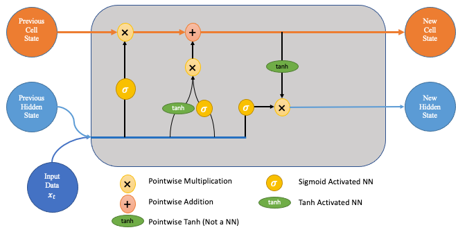
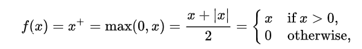

We save every value in float types and I am always referring to TWh

Params that we take in consideration:
- Electricity consumption (global-energy-substitution.csv)
    - primary energy consumption (TWh): float
    - year: int
    - country: string
- Electricity production (electricity-prod-source-stacked.csv)
    - energy generation (TWh): float
    - year: int
    - country: string
- Daily weather data (daily_weather_data.csv):
    - latitude (degrees): float
    - longitude (degrees): float
    - tavg (average temperature, celsius): float
    - tmin (minimum temperature, celsius): float
    - tmax (max temperature, celsius): float
    - wdir (wind direction, degrees): float
    - wspd (wind speed, km/h): float
    - pres (atmosferic pressure, hPa): float
- CO2 emissions per capita (co-emissions-per-capita.csv)
    - country: string
    - year: int
    - annual CO2 emissions per capita (tones): float
- GDP per capita growth (gdp-per-capita-growth.csv)
    - country
    - year
    - GDP per capita growth (annual GDP change %)
- Access to electricity vs gdp per capita (access-to-electricity-vs-gdp-per-capita.csv)
    - country
    - year
    - access to electricity (% of population)
    - GDP per capita, PPP ($)
- Population growth (population-and-demography.csv)
    - country
    - year
    - population
    - Population of children under the age of 1
    - Population of children under the age of 5
    - Population of children under the age of 15
    - Population under the age of 25
    - Population aged 15 to 64 years
    - Population older than 15 years
    - Population older than 18 years
    - Population at age 1
    - Population aged 1 to 4 years
    - Population aged 5 to 9 years
    - Population aged 10 to 14 years
    - Population aged 15 to 19 years
    - Population aged 20 to 29 years
    - Population aged 30 to 39 years
    - Population aged 40 to 49 years
    - Population aged 50 to 59 years
    - Population aged 60 to 69 years
    - Population aged 70 to 79 years
    - Population aged 80 to 89 years
    - Population aged 90 to 99 years
    - Population older than 100 years

Good to know:
- Consumption data has data until 2022
- Production data has data until 2023

Docker: docker-compose up -d

Docker issues: I am getting ELF error and honestly I don't want to fix that yet, if someone can help with that I'll review it

We are going to build 3 models:
1. Linear Regression.
2. RNN.
3. Still thinking what should I do here, let me know if you have any ideas

And then we are going to compare the 3 models.

Information about an RNN (Recurent Neural Network)

The basic structure of RNNs can be broken down into:

Input Layer: The input is a sequence of data points in which each data point corresponds to a specific time step or position in the sequence. At each time step t, the RNN receives an input vector x(t).
Recurrent Units: Recurrent units are the building blocks of RNNs. They maintain an internal state, also known as the hidden state or memory, which allows the network to retain information from previous time steps. The recurrent units process the input data sequentially, taking into account the current input and the previous hidden state, and produce an updated hidden state for the next time step. It is implemented using a simple recurrent neuron called the Long Short-Term Memory (LSTM) or the Gated Recurrent Unit (GRU).
Hidden State: The hidden state of an RNN is a vector that represents the network’s memory or internal state at a particular time step. It captures information from previous time steps and influences the computation for the current time step. The hidden state is updated at each time step based on the current input and the previous hidden state, allowing the network to capture dependencies and patterns in the sequential data.
Output Layer: The output layer of an RNN produces the desired output or prediction based on the processed sequential data. The output can vary depending on the task at hand. For example, in language modeling, the output layer can predict the next word in a sentence. In sentiment analysis, the output layer can predict the sentiment of a given text. The output layer can consist of one or more units, depending on the specific requirements of the task.

Years of data:
For consumption: 76 years
For production: 77 years

LSTM (Long-Short Term Memory) Model:
- Step 1: Data Preparation
Prepare your energy consumption data in a suitable format, typically as a time series dataset with timestamps and corresponding consumption values.
Normalize the data to scale it between 0 and 1, which can help improve training convergence and performance.
- Step 2: Data Preprocessing
Divide the dataset into sequences of input-output pairs suitable for training the LSTM model.
Define the sequence length (number of time steps) and the prediction horizon (how many time steps ahead to forecast).
- Step 3: Model Definition
Define the architecture of the LSTM model, including the number of LSTM layers, number of units in each layer, and any additional layers such as dropout or dense layers.
Compile the model with an appropriate loss function (e.g., Mean Squared Error) and optimizer (e.g., Adam).
- Step 4: Model Training
Train the LSTM model using the prepared input-output pairs.
Specify the number of epochs (iterations over the entire dataset) and batch size (number of samples processed before updating the model's parameters).
- Step 5: Model Evaluation
Evaluate the trained model's performance on a separate validation dataset using appropriate evaluation metrics (e.g., Mean Absolute Error, Mean Squared Error).
Visualize the actual vs. predicted values to assess the model's accuracy and generalization capability.
- Step 6: Model Deployment
Deploy the trained LSTM model for making predictions on new, unseen data.
Integrate the model into your Node.js application to serve predictions in real-time or on-demand.

Where I get most data from: https://ourworldindata.org/
There is another website but guess who forgot

docker run -it --rm -p 8888:8888 tensorflow/tensorflow:latest

Linear Regression

ReLU

